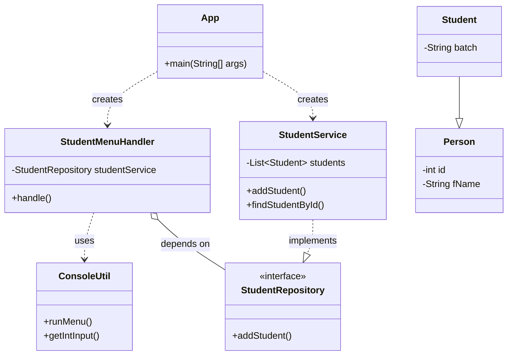

# LearnTrack - Student & Course Management System

LearnTrack is a console-based management system built with Core Java. It allows administrators to manage students, courses, and enrollments through a simple command-line interface. This project is designed to reinforce fundamental Java and OOP principles.

## Project Description

This application provides functionalities for managing educational records. Key features include:
- **Student Management**: Add, remove, update, and list students.
- **Course Management**: Manage course information and activate/deactivate them.
- **Enrollment Management**: Enroll students and update their enrollment status (e.g., to COMPLETED or CANCELLED).

The application runs entirely in the console and uses in-memory `ArrayLists` to store data. All data is reset when the application closes. It features a robust, menu-driven UI with comprehensive exception handling.

## How to Compile and Run

### Prerequisites
- Java Development Kit (JDK) 11 or higher.

### Steps
1.  **Clone the repository**:
    ```sh
    git clone <your-repository-url>
    ```
2.  **Navigate to the project's root directory**:
    ```sh
    cd Course-Management-System
    ```
3.  **Compile the project**:
    From the root directory, use `javac` with the `-d` flag to compile all `.java` source files into a `bin` directory. This correctly handles all packages.

    *On Linux/macOS:*
    ```sh
    mkdir -p bin
    find src -name "*.java" | xargs javac -d bin
    ```

    *On Windows (Command Prompt):*
    ```sh
    mkdir bin
    dir /s /B src\\*.java > sources.txt
    javac -d bin @sources.txt
    del sources.txt
    ```

4.  **Run the application**:
    Execute the main class from the root directory, making sure to specify the `bin` directory in the classpath.
    ```sh
    java -cp bin spring.coding.App
    ```
    You should now see the main menu in your console.

## Class Diagram

This diagram shows the final architecture, including the separation of UI handlers from the main App class and the dependency on repository interfaces.


